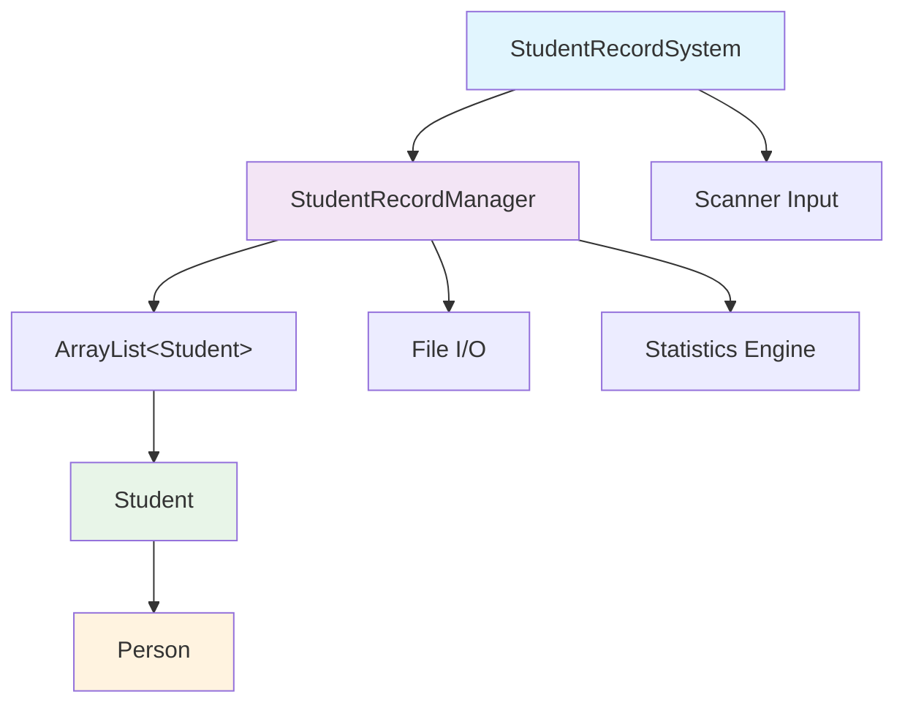
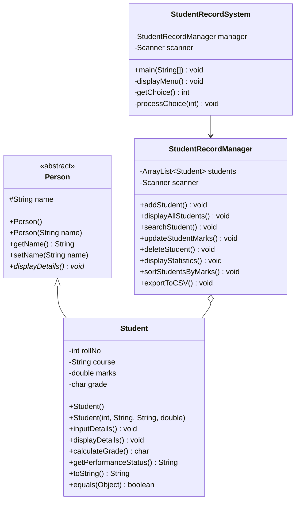
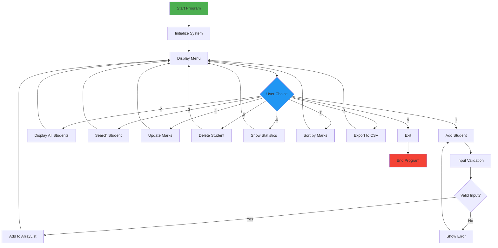

# Student Record Management System

A comprehensive Java-based Student Record Management System that demonstrates Object-Oriented Programming principles, data structures, and user interface design.

( did on - sept 23 2025 - https://github.com/nikhil-shr-23/Java_Lab_Assignment-1)


## Table of Contents
- [Features](#features)
- [System Architecture](#system-architecture)
- [Class Hierarchy](#class-hierarchy)
- [Installation & Setup](#installation--setup)
- [Usage](#usage)
- [Testing](#testing)
- [Additional Features](#additional-features)
- [Technical Specifications](#technical-specifications)

## Features

### Core Features (As per Assignment)
- ✅ Add new student records
- ✅ Display all student records
- ✅ Calculate grades based on marks (A, B, C, D, F)
- ✅ Object-oriented design with inheritance
- ✅ Input validation for marks (0-100)
- ✅ Menu-driven interface

### Additional Features
-  **Search Functionality**: Find students by roll number
-  **Update Records**: Modify student marks and recalculate grades
-  **Delete Records**: Remove student records
-  **Statistics Dashboard**: View class statistics and grade distribution
-  **Sorting**: Sort students by marks (highest to lowest)
-  **Data Export**: Export records to CSV format
-  **Data Validation**: Comprehensive input validation and error handling
-  **User-Friendly Interface**: Enhanced menu system with clear navigation

## System Architecture



## Class Hierarchy



## Program Flow



## 💻 Installation & Setup

### Prerequisites
- Java Development Kit (JDK) 8 or higher
- Any Java IDE (Eclipse, IntelliJ IDEA, VS Code) or command line

### Compilation & Execution

1. **Clone or download the project files**
2. **Compile all Java files:**
   ```bash
   javac *.java
   ```

3. **Run the main program:**
   ```bash
   java StudentRecordSystem
   ```

4. **Run the test suite:**
   ```bash
   java StudentRecordTest
   ```

## Usage

### Main Menu Options

1. **Add Student**: Enter student details (Roll No, Name, Course, Marks)
2. **Display All Students**: View all registered students
3. **Search Student**: Find a student by roll number
4. **Update Student Marks**: Modify marks and recalculate grade
5. **Delete Student**: Remove a student record
6. **Display Statistics**: View class performance analytics
7. **Sort Students by Marks**: Display students ranked by performance
8. **Export to CSV**: Save records to `student_records.csv`
9. **Exit**: Close the application

### Sample Interaction
```
===== Student Record Menu =====
1. Add Student
2. Display All Students
3. Exit
Enter your choice: 1

Enter Roll No: 101
Enter Name: Rahul
Enter Course: B.Tech
Enter Marks: 87.0

Student added successfully!
```

## 🧪 Testing

The system includes comprehensive unit tests in `StudentRecordTest.java`:

- **Student Class Tests**: Constructor, getters, setters, grade calculation
- **Manager Class Tests**: Record management functionality
- **Grade Calculation Tests**: All grade ranges and boundary conditions
- **Data Validation Tests**: Input validation and edge cases

Run tests with:
```bash
java StudentRecordTest
```

## Additional Features

### 1. Enhanced Statistics Dashboard
- Total student count
- Average, highest, and lowest marks
- Grade distribution analysis
- Performance insights

### 2. Data Export Functionality
- Export to CSV format
- Structured data for external analysis
- File handling with error management

### 3. Advanced Search & Sort
- Search by roll number
- Sort by marks (descending order)
- Efficient ArrayList operations

### 4. Robust Error Handling
- Input validation for all data types
- Duplicate roll number prevention
- Graceful error recovery
- User-friendly error messages

## 🔧 Technical Specifications

### Data Types Used
- `String`: name, course
- `int`: rollNo
- `double`: marks
- `char`: grade
- `ArrayList<Student>`: dynamic student storage
- `HashMap<Character, Integer>`: grade distribution

### Design Patterns
- **Inheritance**: Person → Student
- **Encapsulation**: Private fields with public methods
- **Polymorphism**: Method overriding (displayDetails, toString, equals)
- **Composition**: StudentRecordManager contains ArrayList of Students

### Grade Calculation Logic
```java
if (marks >= 90) return 'A';      // Excellent (90-100)
else if (marks >= 80) return 'B'; // Good (80-89)
else if (marks >= 70) return 'C'; // Average (70-79)
else if (marks >= 60) return 'D'; // Below Average (60-69)
else return 'F';                  // Fail (0-59)
```

## 📁 File Structure
```
lab_assign-1/
├── Person.java              # Abstract base class
├── Student.java             # Student entity class
├── StudentRecordManager.java # Business logic layer
├── StudentRecordSystem.java  # Main application class
├── StudentRecordTest.java    # Unit test suite
├── README.md                # This documentation
└── student_records.csv      # Generated export file
```

##  Learning Outcomes Achieved

1. ✅ **Object-Oriented Programming**: Inheritance, encapsulation, polymorphism
2. ✅ **Constructors & Methods**: Default and parameterized constructors
3. ✅ **Arrays & Collections**: ArrayList for dynamic data management
4. ✅ **Control Structures**: Loops, conditionals, switch statements
5. ✅ **Input/Output Operations**: Scanner for user input, file I/O for export
6. ✅ **Error Handling**: Exception handling and input validation
7. ✅ **Data Structures**: HashMap for statistics, ArrayList for storage


---

**Author**: Nikhil Sharma
**Roll No.**: 2401010084 
**Version**: 1.0  
**Date**: 2025-09-23
